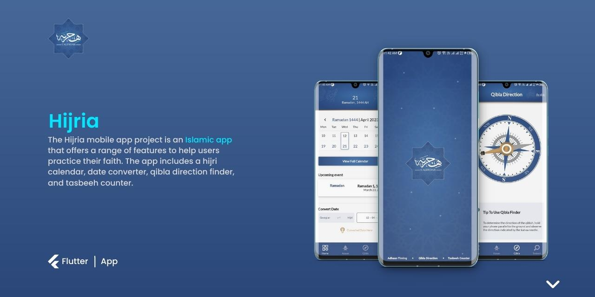
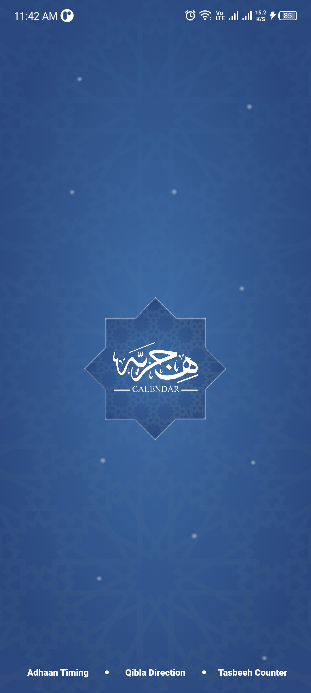
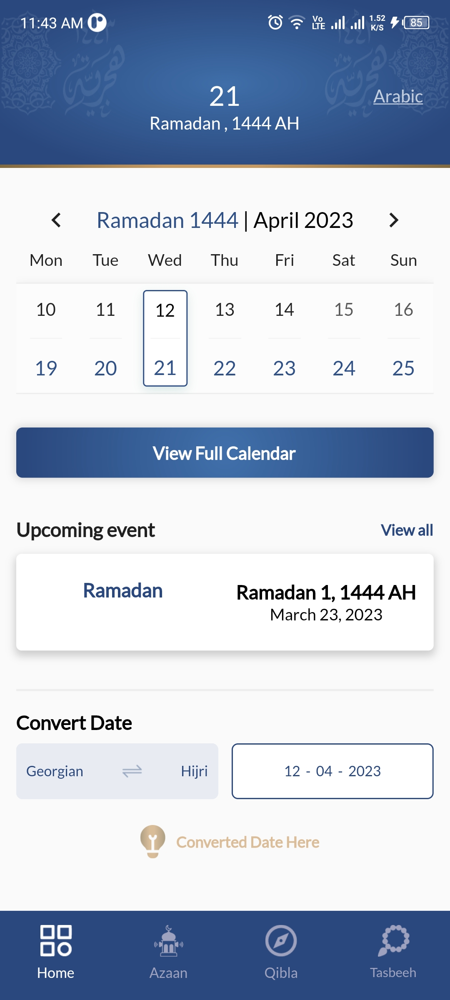
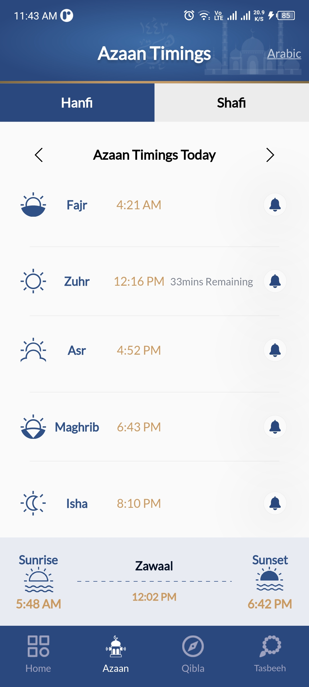
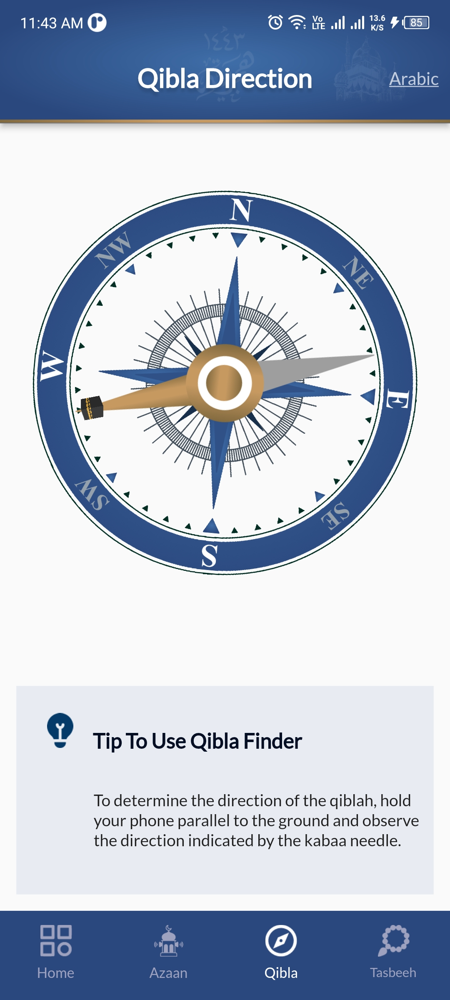
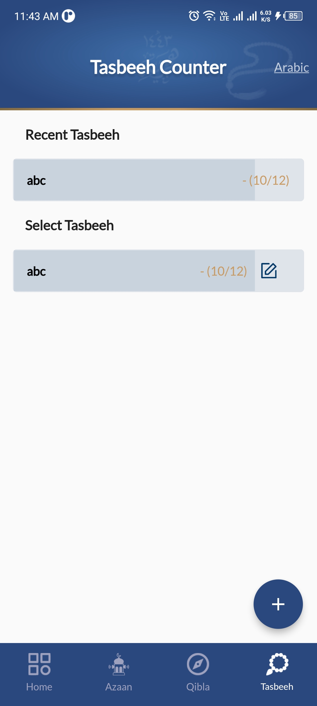
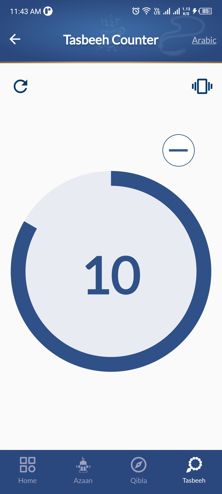
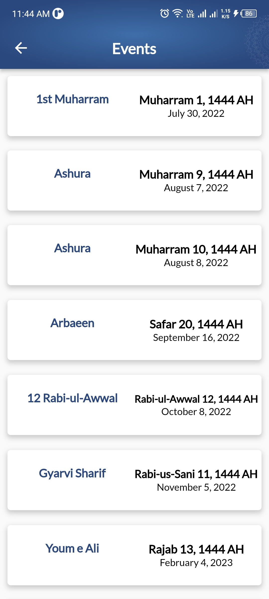

# Hijria-Calendar

INTRODUCTION

The Hijria mobile app project is an Islamic app that offers a range of features to help users practice their faith. The app includes a hijri calendar, date converter, qibla direction finder, and tasbeeh counter. The hijri calendar allows users to easily track Islamic dates and events, while the date converter enables users to convert between hijri and Gregorian dates. The qibla direction finder uses the user's location to help them determine the direction of the Kaaba in Mecca for prayer. The tasbeeh counter allows users to track their dhikr (remembrance of Allah) with a digital counter. Overall, the Hijria mobile app is a useful tool for Muslims looking to stay connected to their faith and practice their daily rituals with ease.

HIJRIA FEATURES
1. Hijria Calendar
2. Islamic Events
3. Hijria - Gregorian Date Converter
4. Azan Timings
5. Tasbeeh Counter
6. Multi-Language

TECHNICALITIES USED
1. Flutter
2. Cubit Statemanagement
3. REST APIs
4. Native Code Invoking
5. Custom Compass

APPLICATION SCREENSHOTS

       

APPLICATION LINKS

App Store Link
https://apps.apple.com/ca/app/hijria/id1623978880

Playstore Link
https://play.google.com/store/apps/details?id=com.jmmtechnologies.hijricalendar

